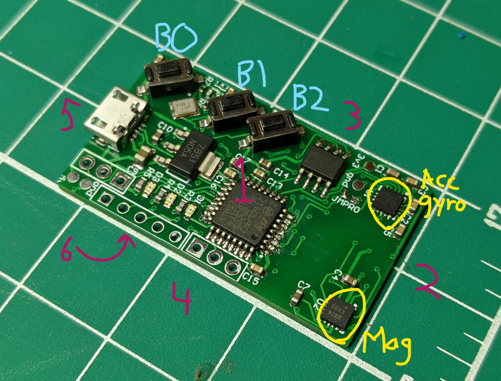
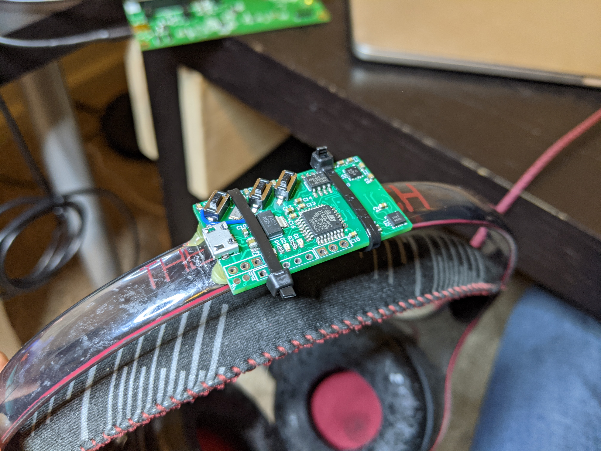

# Mounting

Imagine the device is a cube - we will label each face like the faces of a standard game die.

| Side description | Side number |
| ---------------- | ----------- |
| Top side with all components | Side 1 |
| Side opposite usb port | Side 2 |
| Side with buttons | Side 3 |
| Side opposite buttons | Side 4 |
| Side with usb port | Side 5 |
| Bottom side with github url | Side 6 |

  

You can mount the tracker to headphones or a hat or anything else that is firmly attached to your head. Some things to consider:
* The device needs to be aligned with your head's axes. Any face can be up and any other (physically possible) face can be forwards, but it must be positioned so that it is not crooked. Ie. when you are in your neutral position, one face should be pointed straight up and another straight forwards.
* The magnetometer is sensitive to any magnets, ferromagnetic materials, and wires with significant current flowing through them. Try to find a spot to mount it away from any of these things. Keep in mind, the speakers in your headphones have magnets in them. You can test this by looking at the live data on your computer while you're holding the device still and then bring your headphones/hat/ect. close to the device in the place you intend to mount it. If the data shows phantom rotation, then that is not a good spot to mount it.
* Use an extra flexible USB cable if you have one.
* Mount it as securely as possible, you don't want it being moved around by the cable in when you turn your head. I used hot glue and zip ties.
* Once you've decided where to mount it, take note of the number of the face that is pointing up and the number of the face that is pointing forwards when your head is in your neutral position. Since I didn't bother to create an interface for changing these settings on the device, if you pick anything other than the default values of `1, 3`, you'll need to re-build the firmware binary and load it onto the device. The relevant code is lines 26 and 27 of [initialize.c](./../common_source_files/global/initialize.c). Check the [flashing document](./flashing.md) for instructions on loading a binary file to the device. *Since the number of people besides me currently in possession of one of these is currently `2`, I can build and send you a new binary by request if you don't want to deal with figuring out how to do that.*

